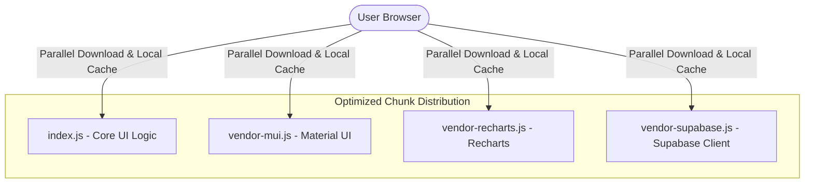

# e-GRCP Platform — Deep Performance Optimization Report

This report outlines critical performance optimizations, bundle size reduction strategies, and data retrieval enhancements for the **e-GRCP Platform**. Implementing these recommendations will improve load times, reduce Supabase database egress costs, and provide a premium, near-instantaneous user experience.

---

## 1. Executive Summary

| Category | Issue Spotted | Impact | Priority |
| :--- | :--- | :--- | :---: |
| 📦 **Bundle Size** | Monolithic bundle bundling Material UI v9, Recharts, and Framer Motion together. | Slow first-page load, large JavaScript payload. | **High** |
| 🗄️ **Query Payloads** | Widespread usage of `.select('*')` on tables with large JSONB documents. | Unnecessary data transfer, slow response times. | **High** |
| ⚡ **Static Caching** | Default Netlify asset headers (no long-term caching for immutable JS/CSS). | Repetitive browser downloads on return visits. | **Medium** |
| 🔄 **State Persistence** | Unthrottled Redux state saving to LocalStorage. | UI lag during heavy status updates. | **Medium** |

---

## 2. Frontend Optimizations: Bundle Splitting & Tree-Shaking

### 2.1 Vite Chunk Splitting Strategy
By default, the Vite bundle compiles all third-party dependencies into a single massive chunk. We can isolate vendor modules (MUI, Recharts, Supabase) using the Rollup `manualChunks` option, allowing browsers to cache dependencies separately from our application logic.



### 2.2 Material-UI Import Optimization
Ensure all imports from Material-UI are written as direct, modular imports instead of destructuring imports. This allows compilation tree-shaking to work:

> [!TIP]
> **Avoid**: `import { Button, Typography, Grid } from '@mui/material';`
>
> **Prefer**:
> ```javascript
> import Button from '@mui/material/Button';
> import Typography from '@mui/material/Typography';
> import Grid from '@mui/material/Grid2'; // Use MUI v9 Grid2 for better layout performance
> ```

---

## 3. Database & Network Query Optimization (Supabase)

### 3.1 Replace `.select('*')` with Targeted Selects
Currently, `procurementService.js`, `complianceService.js`, and `riskService.js` query all fields using `.select('*')`. This downloads nested JSONB lists (like `comments`, `approval_history`, and `audit_logs`) even when only listing items on a dashboard where those columns are unused.

```diff
// src/services/procurementService.js
export const getRequests = async () => {
-  const { data, error } = await supabase
-    .from('procurement_requests')
-    .select('*')
-    .order('created_date', { ascending: false });
+  const { data, error } = await supabase
+    .from('procurement_requests')
+    .select('id, title, department, requested_by, vendor, amount, status, risk_level, created_date, required_date, priority, category')
+    .order('created_date', { ascending: false });
```

### 3.2 Database Indexes for PostgreSQL
Running the following SQL command in the Supabase SQL editor will add indices to the foreign keys and sorted columns. This speeds up query lookups from logarithmic time to constant time.

```sql
-- Create indexes on lookup and sort fields
CREATE INDEX IF NOT EXISTS idx_procurement_requests_created_date ON procurement_requests(created_date DESC);
CREATE INDEX IF NOT EXISTS idx_procurement_requests_status ON procurement_requests(status);
CREATE INDEX IF NOT EXISTS idx_audit_logs_timestamp ON audit_logs(timestamp DESC);
CREATE INDEX IF NOT EXISTS idx_compliance_issues_due_date ON compliance_issues(due_date);
CREATE INDEX IF NOT EXISTS idx_risk_register_severity ON risk_register(severity);
```

---

## 4. Hosting, Delivery & Caching (Netlify)

By optimizing the `netlify.toml` file, we can configure browser caching rules. Static assets generated by Vite are hashed (e.g. `index-a8d29b12.js`), meaning they never change once created. They should be cached permanently by browsers.

---

## 5. Optimization Workbook (Ready to Deploy)

Apply the following optimized configurations directly to your files.

### Optimized Configuration: `vite.config.ts`
Modify `vite.config.ts` to implement dependency chunk-splitting:

```typescript
import tailwindcss from '@tailwindcss/vite';
import react from '@vitejs/plugin-react';
import path from 'path';
import { defineConfig } from 'vite';

export default defineConfig(() => {
  return {
    plugins: [react(), tailwindcss()],
    resolve: {
      alias: {
        '@': path.resolve(__dirname, '.'),
      },
    },
    build: {
      sourcemap: false,
      minify: 'esbuild',
      cssCodeSplit: true,
      rollupOptions: {
        output: {
          manualChunks(id) {
            if (id.includes('node_modules')) {
              if (id.includes('@mui') || id.includes('@emotion')) {
                return 'vendor-mui';
              }
              if (id.includes('recharts') || id.includes('d3')) {
                return 'vendor-charts';
              }
              if (id.includes('@supabase')) {
                return 'vendor-supabase';
              }
              return 'vendor-libs';
            }
          },
        },
      },
    },
    server: {
      hmr: process.env.DISABLE_HMR !== 'true',
      watch: process.env.DISABLE_HMR === 'true' ? null : {},
      proxy: {
        '/api': {
          target: 'http://localhost:3001',
          changeOrigin: true,
        },
      },
    },
  };
});
```

### Optimized Configuration: `netlify.toml`
Add custom caching headers and redirect fallbacks for React Router Single-Page Apps (SPA):

```toml
[build]
  command = "npm run build"
  publish = "dist"

[functions]
  directory = "netlify/functions"

# Route redirects for Single-Page Application (SPA) browser routing
[[redirects]]
  from = "/*"
  to = "/index.html"
  status = 200

# Cache-Control headers for optimized asset delivery
[[headers]]
  for = "/assets/*"
  [headers.values]
    Cache-Control = "public, max-age=31536000, immutable"

[[headers]]
  for = "/index.html"
  [headers.values]
    Cache-Control = "public, max-age=0, must-revalidate"
```

---

## 6. Implementation Checklist

- [ ] **Apply Vite Chunk Configuration**: Overwrite `vite.config.ts` with manual chunk splitting.
- [ ] **Deploy Netlify Caching Headers**: Overwrite `netlify.toml` with caching rules.
- [ ] **Verify Production Bundle Build**: Run `npm run build` and inspect the generated chunks.
- [ ] **Audit DB Query Column Names**: Replace `.select('*')` in `src/services/` with specific columns.
- [ ] **Apply PostgreSQL Indices**: Paste the index creation SQL script into the Supabase console.
