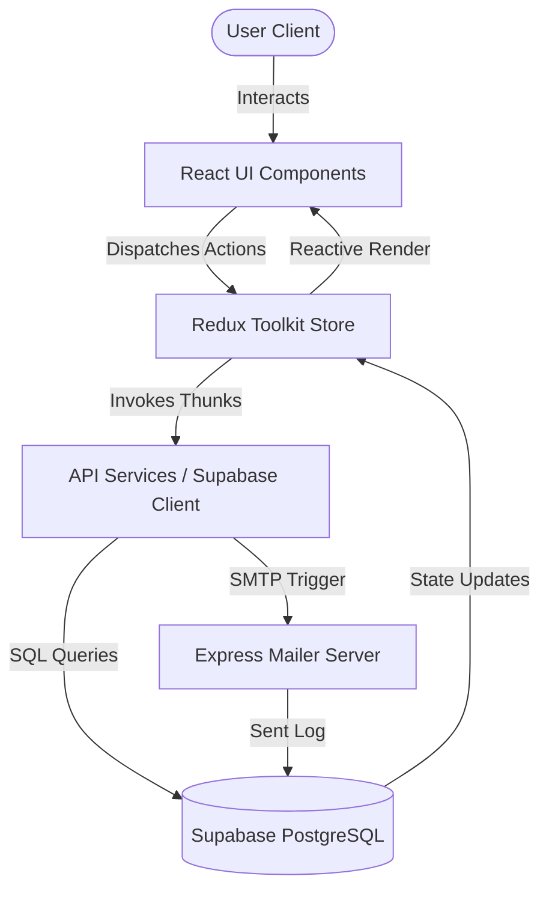

# e-GRCP Platform — Comprehensive Quality Assurance & Testing Report

This report provides a detailed quality assurance, security compliance, and automated testing roadmap for the **Enterprise Governance, Risk, Compliance, and Procurement (e-GRCP) Platform**. 

---

## 1. Executive Summary

| Metirc / Dimension | Status | Notes |
| :--- | :--- | :--- |
| **Codebase Health** | 🟩 **Healthy** | `tsc --noEmit` runs successfully with **0 errors**. |
| **Framework & Engine** | ⚡ **Modern** | Vite 6.x, React 19, Redux Toolkit, Tailwind CSS v4, Material UI v9. |
| **Data Sync Layer** | 🗄️ **Live** | Real-time integrations with Supabase (PostgreSQL tables + RLS policies). |
| **Notification Engine** | 📧 **Active** | SMTP mailer utility using Node & Nodemailer for user alert sync. |
| **Test Coverage Status**| ⚠️ **Pending** | No automated tests (`Jest`, `Vitest`, or `Cypress`) are currently configured in `package.json`. |

---

## 2. Platform Architecture & Testing Flow

The diagram below illustrates how frontend actions travel through Redux slices, trigger Supabase database queries, update audit trails, and dispatch email alerts. Testing should validate each node in this boundary.



---

## 3. Security Matrix & RBAC Test Mapping

The e-GRCP platform relies on a strict **Role-Based Access Control (RBAC)** model defined in `src/utils/constants.js` and enforced by `RoleBasedRoute.jsx`. 

Below is the verified route-access mapping that must be verified in security test cases:

| Module / Page Route | Employee | Procurement Mgr | Compliance Officer | Auditor | Administrator |
| :--- | :---: | :---: | :---: | :---: | :---: |
| `/dashboard` | ✅ | ✅ | ✅ | ✅ | ✅ |
| `/procurement` | ✅ | ✅ | ❌ | ❌ | ✅ |
| `/procurement/create` | ✅ | ✅ | ❌ | ❌ | ✅ |
| `/procurement/:id` | ✅ | ✅ | ❌ | ❌ | ✅ |
| `/vendors` | ❌ | ✅ | ✅ | ❌ | ✅ |
| `/vendors/:id` | ❌ | ✅ | ✅ | ❌ | ✅ |
| `/risk` | ❌ | ❌ | ✅ | ❌ | ✅ |
| `/compliance` | ❌ | ❌ | ✅ | ❌ | ✅ |
| `/audit` | ❌ | ❌ | ❌ | ✅ | ✅ |
| `/approvals` | ❌ | ✅ | ❌ | ❌ | ✅ |
| `/reports` | ❌ | ✅ | ✅ | ✅ | ✅ |
| `/employees` | ❌ | ✅ | ❌ | ❌ | ✅ |
| `/notifications` | ✅ | ✅ | ✅ | ✅ | ✅ |
| `/settings` | ✅ | ✅ | ✅ | ✅ | ✅ |

> [!IMPORTANT]
> **Administrator** has unrestricted access. **Employee** is locked down strictly to their own transactions and settings. **Compliance Officer** handles audits, risk, and compliance. **Auditor** has read-only access to audit registers.

---

## 4. High-Value Functional Test Scenarios

These manual/automated test scenarios target the core features of the system.

### Scenario 4.1: Authentication & Session Hydration
* **Goal**: Validate that login functions, invalid passwords show helpful errors, and sessions persist across page reloads.
* **Test Steps**:
  1. Navigate to `/login`.
  2. Input invalid credentials (e.g., `employee@egrcp.com` with `wrongpass`). Verify that the application displays a clear error warning.
  3. Input valid credentials (e.g., `manager@egrcp.com` with `password123`). Verify successful navigation to `/dashboard`.
  4. Perform a page refresh (F5).
* **Expected Outcome**:
  * Redux-Persist rehydrates the state. The user session remains logged in and does not redirect back to `/login`.

### Scenario 4.2: Procurement Request Lifecycle & Field Validation
* **Goal**: Ensure procurement requests are validated correctly and go through the proper approval steps.
* **Test Steps**:
  1. Log in as **Employee** (`employee@egrcp.com`).
  2. Navigate to `/procurement/create`.
  3. Try to submit with an empty form. Verify that validation errors are displayed.
  4. Submit a valid form with an amount of `$125,000` targeting vendor `Global Tech Solutions Inc.`.
  5. Log out, and log in as **Procurement Manager** (`manager@egrcp.com`).
  6. Open `/approvals` (Approval Workbench). Locate the submitted request.
  7. Click **Approve** and provide a comment: `"Within budget limits"`.
* **Expected Outcome**:
  * The request status changes to `Approved` or `Completed`.
  * An entry is automatically created in `audit_logs` capturing the action.
  * A system notification is dispatched to the employee.

### Scenario 4.3: Vendor Risk Mitigation Rules
* **Goal**: Verify that high-risk/critical vendors alert the compliance team during procurement requests.
* **Test Steps**:
  1. Look up vendor `Nova Cloud Infrastructure` (High Risk) or `Apex Builders Ltd` (Critical Risk).
  2. Create a procurement request for `Apex Builders Ltd`.
  3. Log in as **Compliance Officer** (`compliance@egrcp.com`).
  4. View `/compliance` and check active alerts.
* **Expected Outcome**:
  * The system raises a compliance warning due to expired/missing health & safety or SOC 2 documents.

---

## 5. Recommended Testing Toolchain

To secure this platform, we recommend setting up the following automated testing libraries.

### 5.1 Installation Script
Run this command in the `e-grcp-platform` folder to install the required testing libraries:
```bash
npm install -D vitest @testing-library/react @testing-library/jest-dom @testing-library/user-event jsdom
```

### 5.2 Configure Vitest (`vite.config.ts`)
Add the `test` block to `vite.config.ts` to support unit and integration tests:
```typescript
import { defineConfig } from 'vite';
import react from '@vitejs/plugin-react';

export default defineConfig({
  plugins: [react()],
  test: {
    globals: true,
    environment: 'jsdom',
    setupFiles: './src/test/setup.js',
    coverage: {
      provider: 'v8',
      reporter: ['text', 'json', 'html'],
    },
  },
});
```

### 5.3 Setup File (`src/test/setup.js`)
Create a setup file to extend Jest matches for DOM assertions:
```javascript
import '@testing-library/jest-dom';
```

---

## 6. Ready-to-Use Test Scripts

Here are two initial test files to get your test suite started immediately.

### Test File 1: Utility Tests (`src/utils/roleAccess.test.js`)
This unit test validates the RBAC router logic.

```javascript
import { describe, it, expect } from 'vitest';
import { isRouteAllowed } from './roleAccess';

describe('Role-Based Access Control (RBAC) Matrix', () => {
  it('should allow Administrators to access everything', () => {
    expect(isRouteAllowed('Administrator', '/audit')).toBe(true);
    expect(isRouteAllowed('Administrator', '/risk')).toBe(true);
    expect(isRouteAllowed('Administrator', '/settings')).toBe(true);
  });

  it('should restrict Employees from accessing sensitive modules', () => {
    expect(isRouteAllowed('Employee', '/dashboard')).toBe(true);
    expect(isRouteAllowed('Employee', '/procurement')).toBe(true);
    expect(isRouteAllowed('Employee', '/audit')).toBe(false);
    expect(isRouteAllowed('Employee', '/risk')).toBe(false);
  });

  it('should allow Compliance Officers access to risk and compliance, but not audit', () => {
    expect(isRouteAllowed('Compliance Officer', '/risk')).toBe(true);
    expect(isRouteAllowed('Compliance Officer', '/compliance')).toBe(true);
    expect(isRouteAllowed('Compliance Officer', '/audit')).toBe(false);
  });

  it('should handle undefined or invalid roles gracefully', () => {
    expect(isRouteAllowed(null, '/dashboard')).toBe(false);
    expect(isRouteAllowed(undefined, '/dashboard')).toBe(false);
  });
});
```

### Test File 2: Redux Slice Tests (`src/features/auth/authSlice.test.js`)
This integration test validates that authentication actions update the Redux state correctly.

```javascript
import { describe, it, expect } from 'vitest';
import authReducer, { logout, clearAuthError } from './authSlice';

describe('Auth Redux Slice Reducers', () => {
  const initialState = {
    user: { name: 'Sarah Jenkins', role: 'Procurement Manager' },
    token: 'mock-jwt-token',
    role: 'Procurement Manager',
    isAuthenticated: true,
    loading: false,
    error: 'Previous error message',
    employees: [],
    sentEmails: [],
  };

  it('should return initial state by default', () => {
    expect(authReducer(undefined, { type: 'unknown' })).toEqual({
      user: null,
      token: null,
      role: null,
      isAuthenticated: false,
      loading: false,
      error: null,
      employees: [],
      sentEmails: [],
    });
  });

  it('should handle logout action and clear credentials', () => {
    const updatedState = authReducer(initialState, logout());
    expect(updatedState.isAuthenticated).toBe(false);
    expect(updatedState.user).toBeNull();
    expect(updatedState.token).toBeNull();
    expect(updatedState.role).toBeNull();
  });

  it('should clear errors with clearAuthError action', () => {
    const updatedState = authReducer(initialState, clearAuthError());
    expect(updatedState.error).toBeNull();
  });
});
```

---

## 7. Recommended QA Checklist for Deployments

Before pushing to production, run through these visual and functional check points:

- [ ] **Database Connection Health**: Verify Supabase keys in `.env` are active.
- [ ] **Role Flipping Verification**: Log in as each of the 5 roles to ensure the navigation bar displays the correct links.
- [ ] **Mobile Responsiveness**: Verify the sidebar collapses correctly and layouts stack gracefully on screen widths below `768px`.
- [ ] **Audit Trail Log Generation**: Confirm that creating or approving any procurement request generates a matching entry in the `audit_logs` table.
- [ ] **Email Notifications**: Ensure emails log in the local table and send via SMTP when active.
